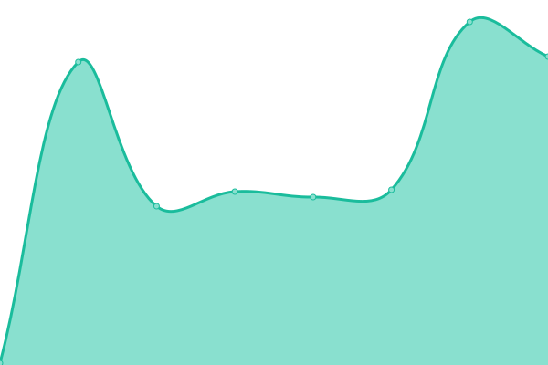
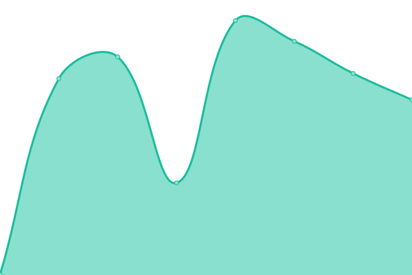

# [📈 Live Status](https://lanej0.github.io/upptime): <!--live status--> **🟩 All systems operational**

<!--start: status pages-->
<!-- This summary is generated by Upptime (https://github.com/upptime/upptime) -->
<!-- Do not edit this manually, your changes will be overwritten -->
<!-- prettier-ignore -->
| URL | Status | History | Response Time | Uptime |
| --- | ------ | ------- | ------------- | ------ |
|  [Jonathan Lane](https://jonathanlane.ca) | 🟩 Up | [jonathan-lane.yml](https://github.com/lanej0/upptime/commits/HEAD/history/jonathan-lane.yml) | 

 137ms
     
 | 

<a href="https://status.industryclients.com/history/jonathan-lane">100.00%</a>
    

|  [Industry Interactive](https://industryinteractive.co) | 🟩 Up | [industry-interactive.yml](https://github.com/lanej0/upptime/commits/HEAD/history/industry-interactive.yml) | 

 169ms
     
 | 

<a href="https://status.industryclients.com/history/industry-interactive">100.00%</a>
    

|  [Testing Blog](http://mytested.com) | 🟩 Up | [testing-blog.yml](https://github.com/lanej0/upptime/commits/HEAD/history/testing-blog.yml) | 

 94ms
     
 | 

<a href="https://status.industryclients.com/history/testing-blog">100.00%</a>
    

|  [Flyingtroll](https://www.flyingtroll.com) | 🟩 Up | [flyingtroll.yml](https://github.com/lanej0/upptime/commits/HEAD/history/flyingtroll.yml) | 

 708ms
     
 | 

<a href="https://status.industryclients.com/history/flyingtroll">100.00%</a>
    

|  [Kelsi](https://kelsilesowski.com) | 🟩 Up | [kelsi.yml](https://github.com/lanej0/upptime/commits/HEAD/history/kelsi.yml) | 

 875ms
     
 | 

<a href="https://status.industryclients.com/history/kelsi">100.00%</a>
    

|  [MICCC](https://mayneislandchamber.ca) | 🟩 Up | [miccc.yml](https://github.com/lanej0/upptime/commits/HEAD/history/miccc.yml) | 

 1003ms
     
 | 

<a href="https://status.industryclients.com/history/miccc">99.78%</a>
    

<!--end: status pages-->

[**Visit our status website →**](https://lanej0.github.io/upptime)

## 📄 License

- Powered by: [Upptime](https://github.com/upptime/upptime)
- Code: [MIT](./LICENSE) © [Jonathan Lane](http://jonathanlane.ca/)
- Data in the `./history` directory: [Open Database License](https://opendatacommons.org/licenses/odbl/1-0/)
