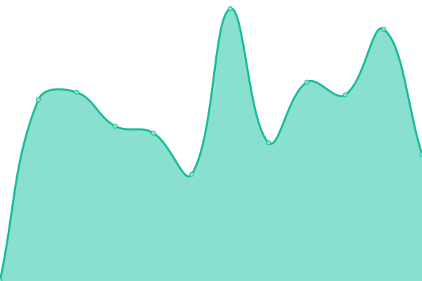

# [📈 Live Status](https://lanej0.github.io/upptime): <!--live status--> **🟧 Partial outage**

This repository contains the open-source uptime monitor and status page for [Jonathan Lane](http://jonathanlane.ca/), powered by [Upptime](https://github.com/upptime/upptime).

With [Upptime](https://upptime.js.org), you can get your own unlimited and free uptime monitor and status page, powered entirely by a GitHub repository. We use [Issues](https://github.com/lanej0/upptime/issues) as incident reports, [Actions](https://github.com/lanej0/upptime/actions) as uptime monitors, and [Pages](https://lanej0.github.io/upptime) for the status page.

<!--start: status pages-->
<!-- This summary is generated by Upptime (https://github.com/upptime/upptime) -->
<!-- Do not edit this manually, your changes will be overwritten -->
<!-- prettier-ignore -->
| URL | Status | History | Response Time | Uptime |
| --- | ------ | ------- | ------------- | ------ |
|  [Easton-Snelgrove.com](https://easton-snelgrove.com) | 🟩 Up | [easton-snelgrove-com.yml](https://github.com/lanej0/upptime/commits/master/history/easton-snelgrove-com.yml) | 

 368ms
     
 | 

<a href="https://lanej0.github.io/upptime/history/easton-snelgrove-com">100.00%</a>
    

|  [Jonathan Lane](https://jonathanlane.ca) | 🟩 Up | [jonathan-lane.yml](https://github.com/lanej0/upptime/commits/master/history/jonathan-lane.yml) | 

 204ms
     
 | 

<a href="https://lanej0.github.io/upptime/history/jonathan-lane">100.00%</a>
    

|  [Industry Interactive](https://industryinteractive.co) | 🟩 Up | [industry-interactive.yml](https://github.com/lanej0/upptime/commits/master/history/industry-interactive.yml) | 

 211ms
     
 | 

<a href="https://lanej0.github.io/upptime/history/industry-interactive">100.00%</a>
    

|  [Testing Blog](https://mytested.com) | 🟥 Down | [testing-blog.yml](https://github.com/lanej0/upptime/commits/master/history/testing-blog.yml) | 

 0ms
     
 | 

<a href="https://lanej0.github.io/upptime/history/testing-blog">0.62%</a>
    

|  [Flyingtroll](https://www.flyingtroll.com) | 🟩 Up | [flyingtroll.yml](https://github.com/lanej0/upptime/commits/master/history/flyingtroll.yml) | 

 775ms
     
 | 

<a href="https://lanej0.github.io/upptime/history/flyingtroll">100.00%</a>
    

|  [Kelsi](https://kelsilesowski.com) | 🟩 Up | [kelsi.yml](https://github.com/lanej0/upptime/commits/master/history/kelsi.yml) | 

 611ms
     
 | 

<a href="https://lanej0.github.io/upptime/history/kelsi">100.00%</a>
    

|  [MICCC](https://mayneislandchamber.ca) | 🟩 Up | [miccc.yml](https://github.com/lanej0/upptime/commits/master/history/miccc.yml) | 

 514ms
     
 | 

<a href="https://lanej0.github.io/upptime/history/miccc">100.00%</a>
    

|  [Tree Frog](https://treefroggallery.ca) | 🟥 Down | [tree-frog.yml](https://github.com/lanej0/upptime/commits/master/history/tree-frog.yml) | 

 0ms
     
 | 

<a href="https://lanej0.github.io/upptime/history/tree-frog">0.58%</a>
    

|  [Hotelst.at](https://hotelst.at) | 🟥 Down | [hotelst-at.yml](https://github.com/lanej0/upptime/commits/master/history/hotelst-at.yml) | 

 0ms
     
 | 

<a href="https://lanej0.github.io/upptime/history/hotelst-at">3.45%</a>
    

<!--end: status pages-->

[**Visit our status website →**](https://lanej0.github.io/upptime)

## 📄 License

- Powered by: [Upptime](https://github.com/upptime/upptime)
- Code: [MIT](./LICENSE) © [Jonathan Lane](http://jonathanlane.ca/)
- Data in the `./history` directory: [Open Database License](https://opendatacommons.org/licenses/odbl/1-0/)
