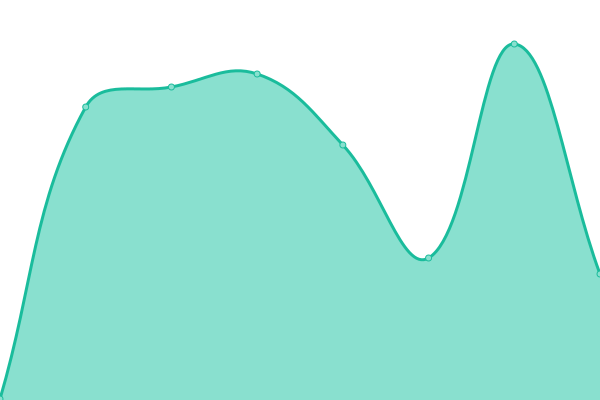

# [📈 Live Status](https://lanej0.github.io/upptime): <!--live status--> **🟩 All systems operational**

<!--start: status pages-->
<!-- This summary is generated by Upptime (https://github.com/upptime/upptime) -->
<!-- Do not edit this manually, your changes will be overwritten -->
<!-- prettier-ignore -->
| URL | Status | History | Response Time | Uptime |
| --- | ------ | ------- | ------------- | ------ |
|  [Jonathan Lane](https://jonathanlane.ca) | 🟩 Up | [jonathan-lane.yml](https://github.com/lanej0/upptime/commits/HEAD/history/jonathan-lane.yml) | 

 152ms
     
 | 

<a href="https://lanej0.github.io/upptime/history/jonathan-lane">100.00%</a>
    

|  [Flyingtroll](https://flyingtroll.com) | 🟩 Up | [flyingtroll.yml](https://github.com/lanej0/upptime/commits/HEAD/history/flyingtroll.yml) | 

 439ms
     
 | 

<a href="https://lanej0.github.io/upptime/history/flyingtroll">86.98%</a>
    

|  [Mayne Island dot com](https://mayneisland.com) | 🟩 Up | [mayne-island-dot-com.yml](https://github.com/lanej0/upptime/commits/HEAD/history/mayne-island-dot-com.yml) | 

 153ms
     
 | 

<a href="https://lanej0.github.io/upptime/history/mayne-island-dot-com">100.00%</a>
    

|  [TestResult](https://testresult.co/) | 🟩 Up | [test-result.yml](https://github.com/lanej0/upptime/commits/HEAD/history/test-result.yml) | 

 192ms
     
 | 

<a href="https://lanej0.github.io/upptime/history/test-result">100.00%</a>
    

|  [Bookmarks](https://save.flyingtroll.com/) | 🟩 Up | [bookmarks.yml](https://github.com/lanej0/upptime/commits/HEAD/history/bookmarks.yml) | 

 490ms
     
 | 

<a href="https://lanej0.github.io/upptime/history/bookmarks">86.98%</a>
    

<!--end: status pages-->

[**Visit our status website →**](https://lanej0.github.io/upptime)

## 📄 License

- Powered by: [Upptime](https://github.com/upptime/upptime)
- Code: [MIT](./LICENSE) © [Jonathan Lane](http://jonathanlane.ca/)
- Data in the `./history` directory: [Open Database License](https://opendatacommons.org/licenses/odbl/1-0/)
